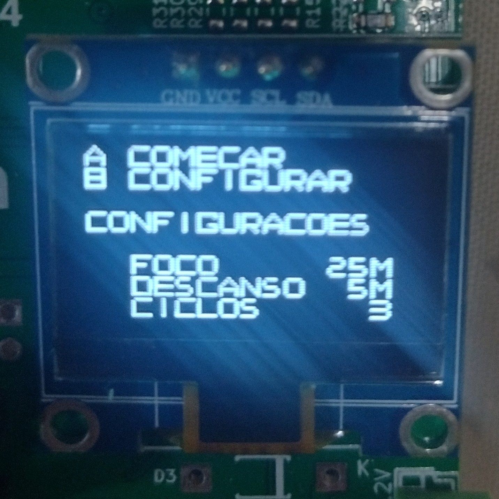
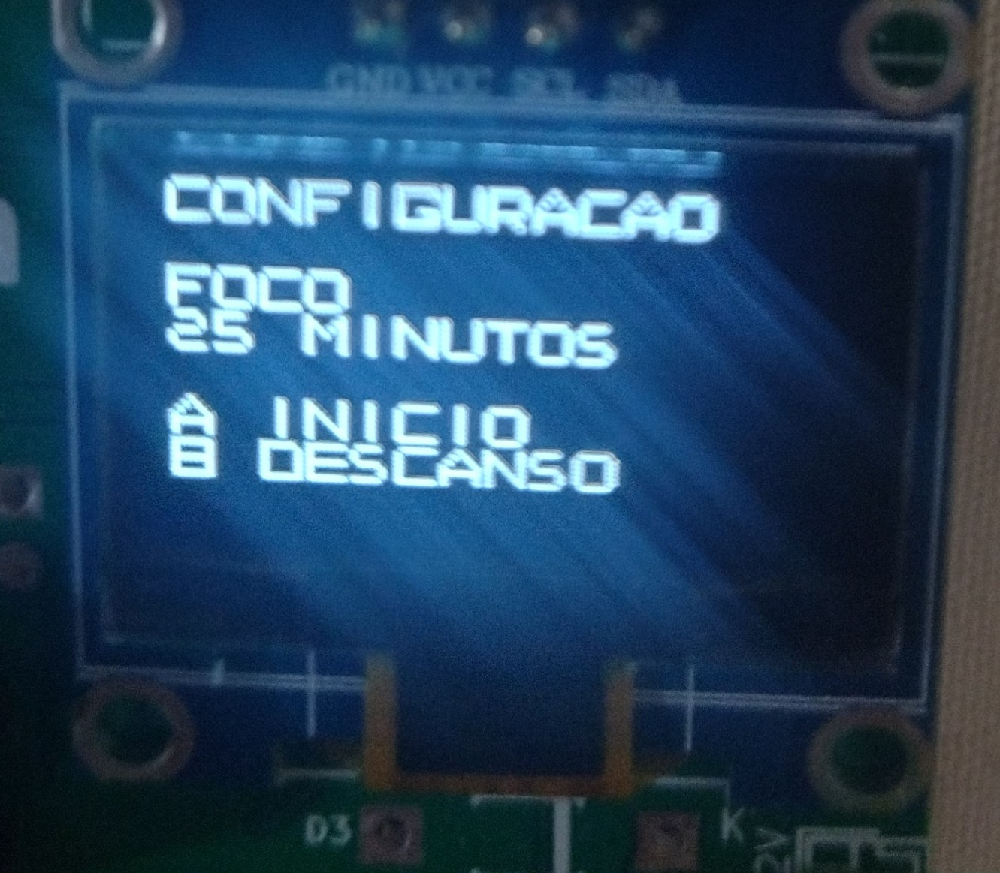
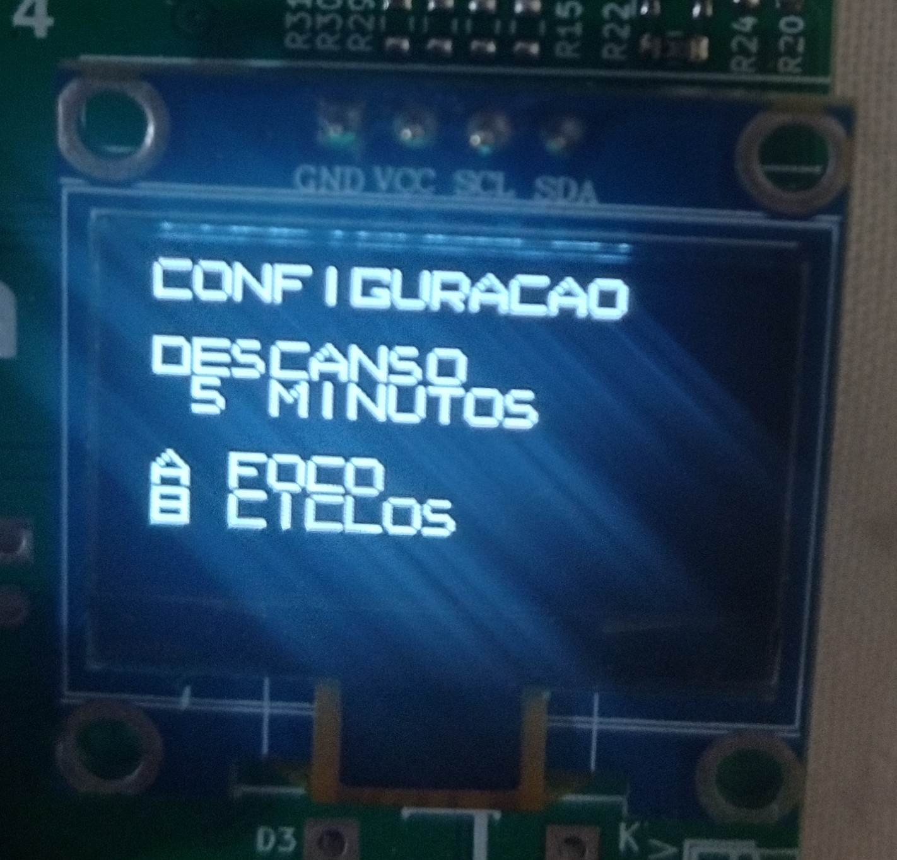
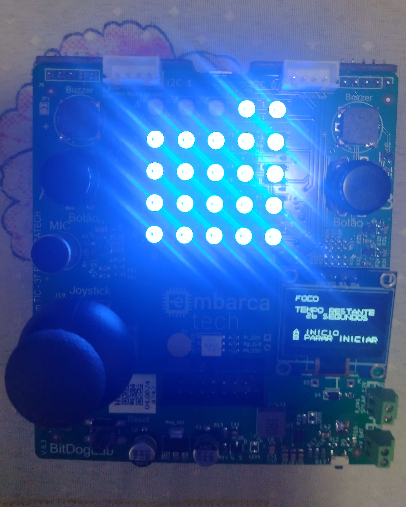
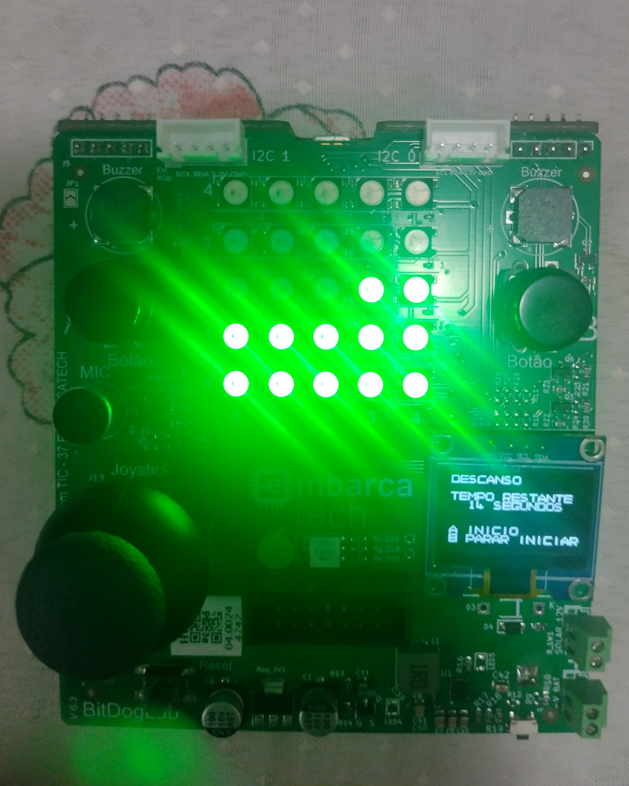

# Pomodoro Timer

Autor: José Augusto Alves de Moraes

Curso: Residência Tecnológica em Sistemas Embarcados

Instituição: EmbarcaTech - HBr

Brasília, março de 2025

---

## Objetivos

O objetivo deste projeto foi criar um Pomodoro Timer utilizando o máximo de recursos disponíveis na BitDogLab, a fim de praticar os princípios básicos desenvolvidos durante a primeira fase do EmbarcaTech.

This project's objective was to create a Pomodoro Timer using the maximum amount of available resources from the BitDogLab, with the final objective of practicing all the basic principles learned during the first phase of EmbarcaTech.

---

## Componentes Utilizados

Para o desenvolvimento deste projeto foi usada exclusivamente a BitDogLab usando a seguinte pinagem.

This project was implemented using only the BitDogLab with the following components connected to it.

| Component          | Amount | GPIO               |
| ------------------ | ------ | -------------------|
| Passive Buzzer     | 1      | 21                 |
| Buttons            | 2      | 5, 6               |
| OLED Display       | 1      | 14 (SDA), 15 (SDC) |
| Joystick           | 1      | 26 (X axis)        |
| RGB Led Matrix 5x5 | 1      | 7                  |

---

## Utilização

### Dependêcias

- Pico C SDK
- VS Code Raspberry Pi Pico Extension

### Como Compilar e Executar

Dentro do VS Code, selecione a opção "Compile Pico Project" usando o menu de comandos, Ctrl+Shift+P por padrão para abrir o menu, para compilar o projeto. Após compilado, conecte a placa em modo Bootsel, pressionando o botão Bootsel enquanto conecta a placa no computador feito isso passe o arquivo pomodoro.elf para a placa usando a ferramenta picotool load da Pico C SDK ou passe o arquivo manualmente usando um gestor de arquivos, ou o terminal.

In VS Code select the "Compile Pico Project" option inside the commands' menu, you may use the default Ctrl+Shift+P shortcut to open it, to compile the project. With the compiled project, connect the board in Bootsel mode by pressing the Bootsel button while connecting it to the computer. With the board connected, use the picotool load command from the Pico C SDK or a manual method to load the pomodoro.elf file in your board.

---

## Imagens de Demonstração

### Tela inicial e Telas de configuração

    
    
    
    

### Timer em Funcionamento

    
    

